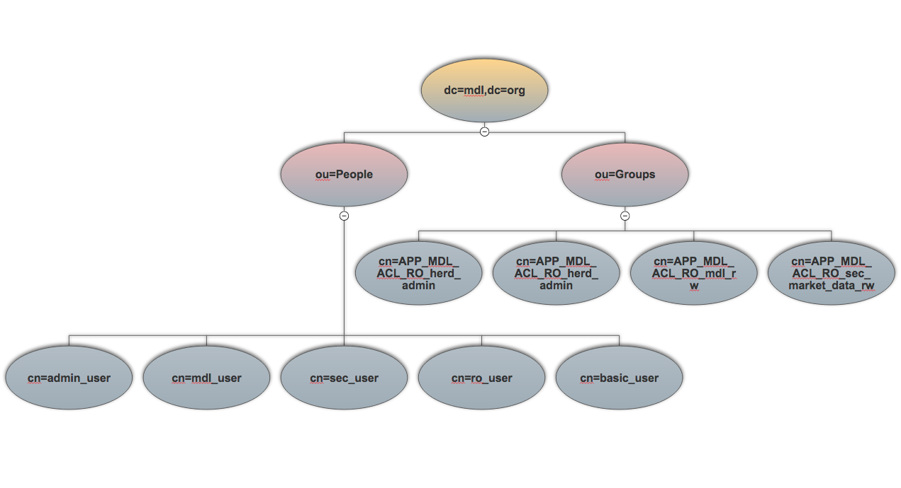

### MDL OpenLDAP organization

MDL uses an OpenLDAP installation to manage User authentication and authorization across all its components.

There are 2 main Organizational Units ([OU](https://en.wikipedia.org/wiki/LDAP_Data_Interchange_Format)s) which are used:

1. <b>ou=People</b>: Each individual user is a member of this organizational unit. These are what employees, users or service accounts are represented with.
2. <b>ou=Groups</b>: Users may be part of 'auth-groups' (also known as AD groups) which are members of this organizational unit. This helps grouping users together
    and applying cross-cutting policies or privileges across users which are members of a given group.
    
## Attributes on MDL LDAP objects

1. <b>User attributes</b>: List of attributes with example values which are defined for objects of type User:


```
 dn: cn=sec_user,ou=People,dc=mdl,dc=org
 objectClass: inetOrgPerson
 objectClass: posixAccount
 uid: sec_user
 cn: sec_user
 sn: null
 userPassword:: e1NTSEF9WVlaaGJxYmhGbTRwQ1JWaERRdUdVV3gyc3l4OHlPWUU=
 uidNumber: 10003
 gidNumber: 1001
 homeDirectory: /home/sec_user
 mail: sec_user@mdl.org
 loginShell: /bin/bash
``` 

2. <b>Group attributes</b>: List of attributes with example values which are defined for objects of type Group:


```
dn: cn=APP_MDL_ACL_RO_herd_ro,ou=Groups,dc=mdl,dc=org
cn: APP_MDL_ACL_RO_herd_ro
objectClass: top
objectClass: groupOfNames
member: cn=ro_user,ou=People,dc=mdl,dc=org
member: cn=basic_user,ou=People,dc=mdl,dc=org
```

## memberOf Overlay

Herd uses ['memberOf'](https://www.openldap.org/doc/admin24/overlays.html) information contained in each request's HTTP headers to determine the auth-groups a user is part of and 
subsequently allows/blocks actions which are pre-defined in a `role-to-security-function` mapping.

This overlay is installed and enabled in MDL's OpenLDAP installation. Please note that the memberOf attribute is an operational attribute, and it is requested explicitly
by the Apache webserver which reverse-proxies to the Herd app.
   


### LDAP directory tree

A pictorial representation of MDL's LDAP directory structure:

