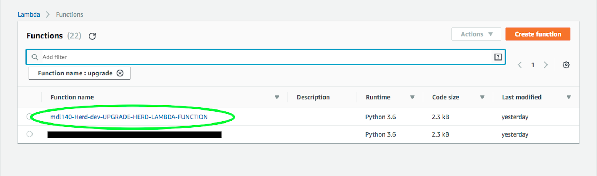
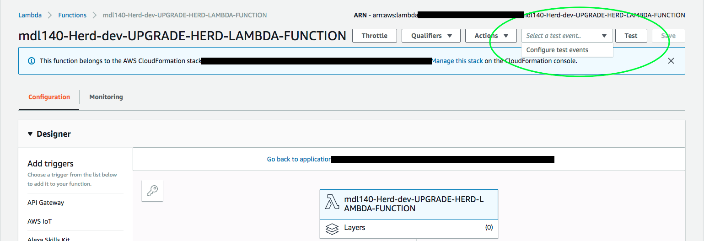
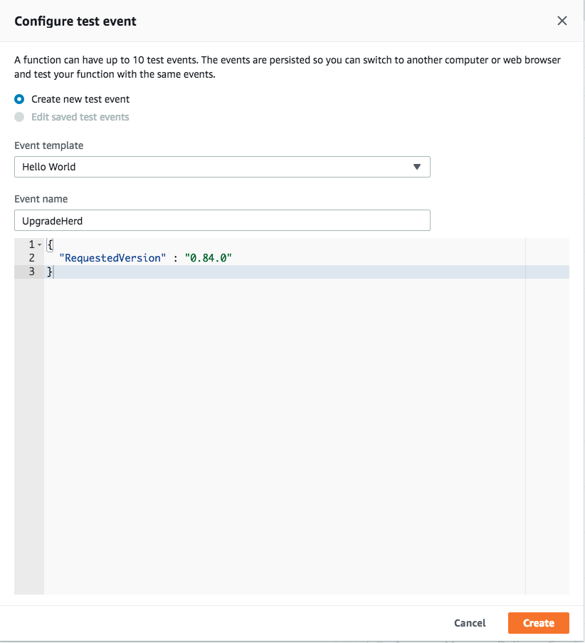
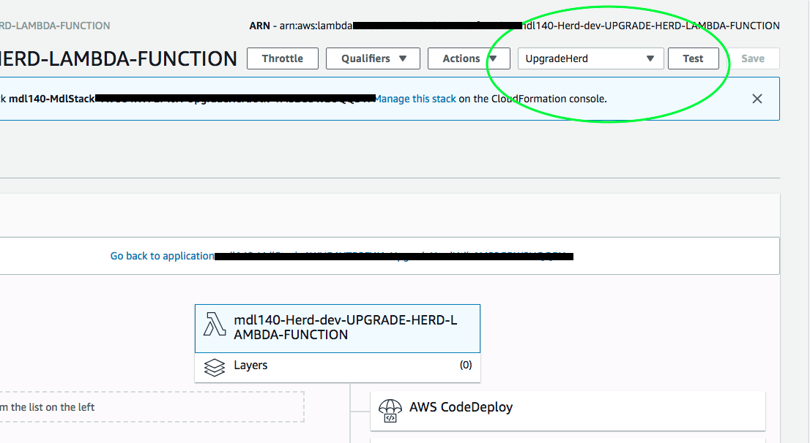
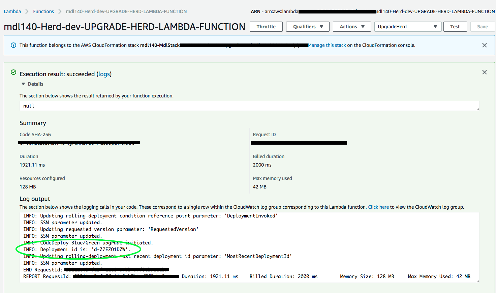
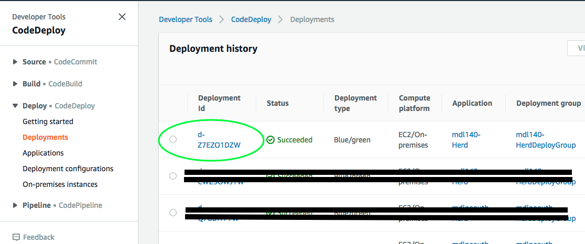
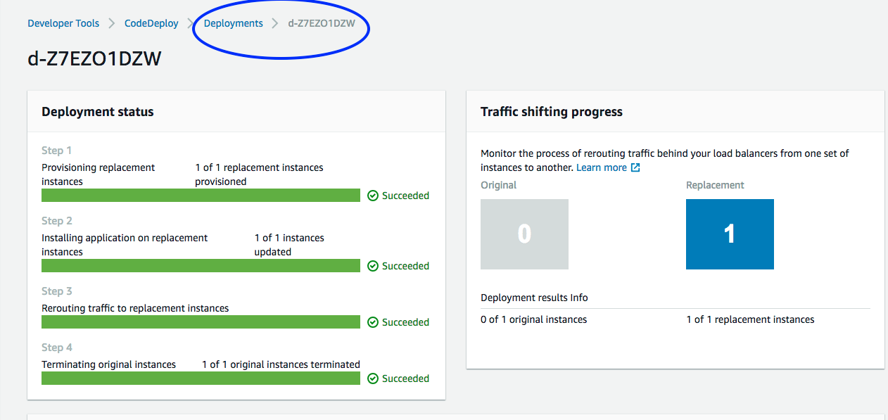
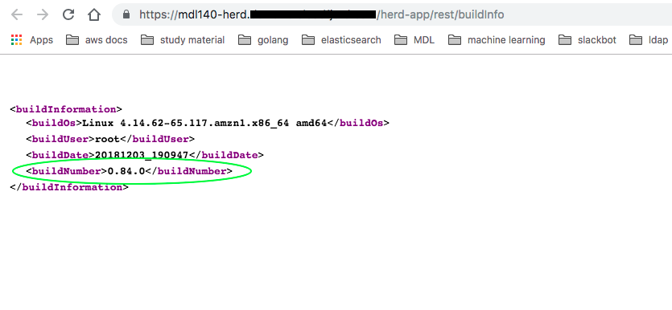

MDL Tutorials and walk-throughs
===============================

## Performing a zero-downtime upgrade on HERD

MDL supports Performing zero-downtime Deployments of HERD with AWS CodeDeploy in a [Blue/Green](https://martinfowler.com/bliki/BlueGreenDeployment.html) fashion.
We chose Blue/Green as our deployment model for upgrades because of the various advantages it offers, viz. 

  * Zero-downtime for clients using the system
  * The ability to perform smoke-tests *before* traffic is rerouted and a newer version goes live

In the following section we'll show you how to perform a zero-downtime upgrade by using the AWS console.

1. Login to the AWS console and select the *Lambda* service.
> Note: The rolling upgrade Lambda function is created in the same region that your MDL stack was stood up in.

2. Find the upgrade Herd lambda function for your stack, it follows the following naming-convention:
   _${MDLInstanceName}-Herd-${Environment}-UPGRADE-HERD-LAMBDA-FUNCTION_   
 
        
     
 
3. Click on the lambda function and proceed to configure a test-event on the top-right corner. We'll use this test-event to invoke the lambda function.   

         
   
4. Click on *Configure test events* drop-down menu item and create a new test-event for the lambda function.    

           
   

5. Select the test-event we created in the previous step and click on the *Test* button on the top-right corner.   

         
      
6. At this point the deployment has been invoked and you could simply stop here and wait for the requested version of HERD to be avaiable (which normally takes about 15 minutes).
   To verify - access HERD's _buildInfo_ page and check if the requested version is available.
     
   You could also monitor the deployment progress in the AWS CodeDeploy console; to do that, note down the `deployment-id` from the lambda execution logs which appear in the previous step after
   you clicked on the *Test* button and the execution completed.   
   
          
      
   Next, navigate to the CodeDeploy service in the AWS console and select *Deployments* from the side-bar, then select the deployment-id we noted down previously. 
   > Note: The deployment's *status* might show *in-progress* and it should change to *successful* afterwards. 
   
    
      
       
      
   Wait for the deployment - it is complete when all 4 steps are *Successful* as shown in the following image   
   
        
   
    
   Access HERD's *buildInfo* page and verify that the requested version is now available. 
    
  > Note: A link to the buildInfo page can be found in the outputs section of the nested Herd Stack when MDL was deployed. 

        

   
   
   